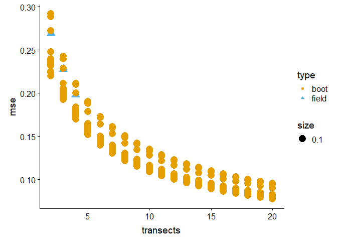
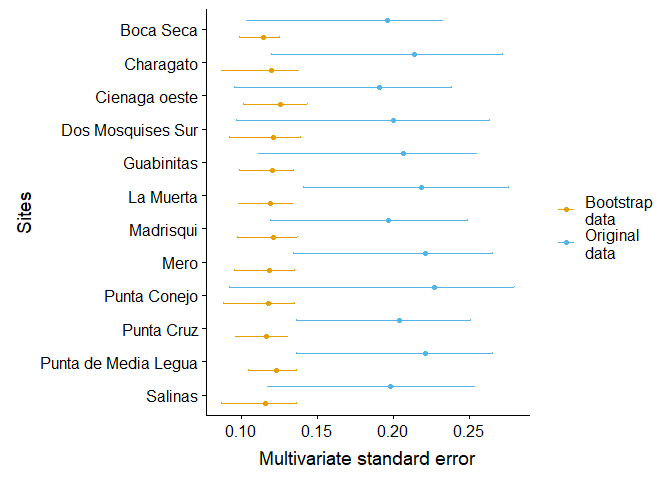

Coral MuSE
================
LMM, EM, MV, AC, et al
14 de enero de 2019

# Packages

``` r
library(tidyverse)
```

    ## Warning: package 'tidyverse' was built under R version 3.6.2

    ## -- Attaching packages -------------------------------------------- tidyverse 1.3.0 --

    ## v ggplot2 3.2.1     v purrr   0.3.3
    ## v tibble  2.1.3     v dplyr   0.8.3
    ## v tidyr   1.0.0     v stringr 1.4.0
    ## v readr   1.3.1     v forcats 0.4.0

    ## Warning: package 'ggplot2' was built under R version 3.6.1

    ## Warning: package 'tibble' was built under R version 3.6.2

    ## Warning: package 'tidyr' was built under R version 3.6.2

    ## Warning: package 'purrr' was built under R version 3.6.2

    ## Warning: package 'dplyr' was built under R version 3.6.2

    ## -- Conflicts ----------------------------------------------- tidyverse_conflicts() --
    ## x dplyr::filter() masks stats::filter()
    ## x dplyr::lag()    masks stats::lag()

``` r
library(magrittr)
```

    ## 
    ## Attaching package: 'magrittr'

    ## The following object is masked from 'package:purrr':
    ## 
    ##     set_names

    ## The following object is masked from 'package:tidyr':
    ## 
    ##     extract

``` r
library(vegan)
```

    ## Warning: package 'vegan' was built under R version 3.6.2

    ## Loading required package: permute

    ## Loading required package: lattice

    ## This is vegan 2.5-6

``` r
library(jtools)
library(trafo)
```

    ## Registered S3 method overwritten by 'pryr':
    ##   method      from
    ##   print.bytes Rcpp

``` r
library(colorblindr)
```

    ## Loading required package: colorspace

``` r
library(viridis)
```

    ## Loading required package: viridisLite

``` r
library(ggrepel)
```

    ## Warning: package 'ggrepel' was built under R version 3.6.1

``` r
library(scales)
```

    ## 
    ## Attaching package: 'scales'

    ## The following object is masked from 'package:viridis':
    ## 
    ##     viridis_pal

    ## The following object is masked from 'package:purrr':
    ## 
    ##     discard

    ## The following object is masked from 'package:readr':
    ## 
    ##     col_factor

``` r
library(cowplot)
```

    ## 
    ## Attaching package: 'cowplot'

    ## The following object is masked from 'package:ggplot2':
    ## 
    ##     ggsave

``` r
source('R/MSEgroup.R')
source('R/BootResampler.R')
```

## Other preliminaries

``` r
if (!dir.exists('analysis/figures')){dir.create('analysis/figures')}

if (!dir.exists('analysis/outcomes')){dir.create('analysis/outcomes')}

if (!dir.exists('supplementary')){dir.create('supplementary')}
```

``` r
#run to check for any extra appends or unassigned points
#source('r/error_checker.R')
```

# Field data

``` r
reef_pts <- read.csv('data/Points_Transect_BenthicSubstrate.csv', 
                     check.names = F, stringsAsFactors = T)
#
groups <- reef_pts[,2:6]
#
available_files <- reef_pts[reef_pts$File %in%
                        list.files("data/transects"), ]

coral_spp <- read.csv('data/caribbean_spp.csv')
```

``` r
coral_cover <-   reef_pts %>% 
  select(-c(1:6)) %>% 
  select(one_of(as.character(coral_spp[coral_spp$Group.ID %in% c(1:9), "Species.name"]))) %>% 
  divide_by(375) %>% 
  multiply_by(100) %>%
  mutate(dummy = 1) %>%   #add a dummy variable
  vegdist(method = "bray")
```

## Field data MuSE

``` r
raw_mse <- coral_cover %>% 
  MSEgroup.d(groups$Site) %>% 
  data.frame() %>% 
  mutate(sites = rownames(.)) %>% 
  gather(-sites, key = 'replicate', value = "MSE") %>% 
  separate(replicate, 
           into = c('value', 'replicate'), 
           sep = '[.]') %>% 
  spread(value, MSE) %>% 
  filter(replicate != 1) %>% #exclude 1st transect
  mutate(replicate = as.numeric(replicate), 
         sites =  as.factor(sites)) %>% 
  rename(mse = means) %>% 
  filter(sites != 'Petaquire' | replicate != 4) %>% 
  mutate(replicate = replace(replicate, 
                             sites == 'Petaquire' & replicate == 3, 4)
         )
```

``` r
field_mse <- raw_mse %>% 
  filter(replicate == 4) %>% 
  left_join(groups[groups$Transect == 't3',], 
            by = c('sites' = 'Site')) %>% 
  mutate(range = upper-lower) %>% 
  mutate(prop = range/mse) %>% 
  arrange(Locality)

field_mse$sites <- factor(field_mse$sites, 
                           levels = field_mse$sites[order(field_mse$Locality)])
```

## Fig 02

``` r
ggplot(field_mse, aes(x = fct_rev(sites), 
                      y = mse, 
                      color = Locality)) + 
  geom_point(stat = 'identity') +
  geom_errorbar(aes(ymin = lower, ymax = upper), 
                width= .1) +
  coord_flip() +
  geom_hline(yintercept = mean(field_mse$mse)) +
  geom_rect(xmin = -Inf,
            xmax = Inf,
            ymin = mean(field_mse$mse)-mean(field_mse$mse)/sqrt(length(field_mse$mse)),
            ymax = mean(field_mse$mse)+mean(field_mse$mse)/sqrt(length(field_mse$mse)),
            alpha = 0.02,
            fill = 'grey',
            color = NA) +
  labs(x = "Sites", y = 'Multivariate standard error') +
  theme(axis.text=element_text(size=10)) +
  guides(fill = FALSE) +
  scale_color_OkabeIto()
```

<!-- -->

``` r
#ggsave('analysis/figures/fig02.svg', width = 6, height = 6)
```

### Richness

``` r
coral_rich <- reef_pts %>% 
  select(-c(1:6)) %>% 
  select(one_of(as.character(coral_spp[coral_spp$Group.ID %in% c(1:9), "Species.name"]))) %>%
  specnumber(groups = reef_pts$Site) %>% 
  data.frame() %>% 
  rename(richness = '.') %>% 
  rownames_to_column('sites')
```

### Univariate precision

``` r
cover_prec <- reef_pts %>% 
  #select(-c(1:6)) %>% 
  select(one_of(as.character(coral_spp[coral_spp$Group.ID %in% c(1:9), "Species.name"]))) %>% 
  divide_by(375) %>% 
  multiply_by(100) %>%
  mutate(total = rowSums(.[])) %>%
  select(total) %>% 
  bind_cols(reef_pts[,c(1:6)]) %>% 
  group_by(Site, Locality) %>% 
  summarise(mean_cover = mean(total), sd_cover = sd(total), n = length(total)) %>% 
  mutate(precision = (sd_cover/sqrt(n))/mean_cover) %>% 
  mutate(se = (sd_cover/sqrt(n))) %>% 
  rename(sites = Site)
```

    ## Warning: Unknown columns: `Acropora prolifera`, `Acropora sp.`, `Madracis
    ## carmabi`, `Madracis formosa`, `Porites divaricata`, `Porites furcata`, `Other
    ## (Scleractinian branching)`, `Agaricia agaricites (purpurea)`, `Agaricia
    ## fragilis`, `Agaricia grahamae`, `Agaricia lamarcki`, `Agaricia undata`,
    ## `Leptosteris cucullata`, `Meandrina jacksoni`, `Mycetophyllia aliciae`,
    ## `Mycetophyllia daniana`, `Mycetophyllia ferox`, `Mycetophyllia lamarckiana`,
    ## `Mycetophyllia reesi`, `Mycetophyllia sp.`, `Agaricia agaricites (carinata)`,
    ## `Favia fragum`, `Isophyllia rigida`, `Isophyllia sinuosa`, `Madracis senaria`,
    ## `Manicina aerolata`, `Meandrina danae`, `Solenastrea bournoni`, `Solenastrea
    ## hyades`, `Other (Scleractinian pillar)`, `Scolymia cubensis`, `Scolymia lacera`,
    ## `Scolymia sp.`, `Madracis pharensis`, `Other (Scleractinian knobby)`, `Cladocora
    ## arbuscula`, `Tubastrea sp.`, `Tubastrea coccinea`

``` r
cover_prec$sites <- factor(cover_prec$sites, 
                           levels = cover_prec$sites[order(cover_prec$Locality)])
```

``` r
coral_summ <- field_mse[,c('mse', 'sites', 'Locality')] %>% 
  left_join(cover_prec[,c('se', 'sites', 'Locality')]) %>% 
  left_join(coral_rich)
```

    ## Joining, by = c("sites", "Locality")Joining, by = "sites"

    ## Warning: Column `sites` joining factor and character vector, coercing into
    ## character vector

## Fig 03

``` r
p1 <- ggplot(coral_summ, aes(x = se,
                             y = mse, 
                             label = sites,
                             color = Locality,
                             size = 2)) +
  geom_point(position = 'jitter') +
  scale_color_OkabeIto() +
  guides(size = FALSE) +
  labs(x = "Univariate standard error",
       y = "Multivariate standard error")+
  annotate("text", 
           label = paste("Pearson's correlation =", 
                                 round(cor(coral_summ$mse, coral_summ$se), 2)), 
           x = 3, y = 0.25)

p2 <- ggplot(coral_summ, aes(x = richness, 
             y = mse, 
             label = sites,
             color = Locality,
             size = 2)) +
  geom_point(position = 'jitter') +
  scale_color_OkabeIto() +
  guides(size = FALSE) +
  labs(x = "Coral species richness",
       y = "Multivariate standard error") +
  annotate("text", 
           label = paste("Pearson's correlation =", 
                                 round(cor(coral_summ$mse, coral_summ$richness), 2)), 
           x = 8.5, y = 0.25)

plot_grid(
  plot_grid(
    p1 + theme(legend.position = 'none'),
    p2 + theme(legend.position = 'none'),
    nrow = 1, align = "v", labels = c('A', 'B')
    ),
  get_legend(p1 + scale_shape(guide = FALSE) + 
      theme(legend.position = "bottom")),
  ncol=1, rel_heights=c(.85, .15)
)
```

<!-- -->

``` r
#ggsave('analysis/figures/fig03.svg')
```

Now we choose the set of sites for resampling

``` r
field_mse %>% 
  arrange(desc(mse)) %>% 
  filter(range %in% head(range, 12))
```

    ##                   sites replicate      lower       mse     upper      Locality
    ## 1          Punta Conejo         4 0.09244417 0.2268283 0.2795950       Cubagua
    ## 2  Punta de Media Legua         4 0.13613383 0.2211442 0.2652300 Chichiriviche
    ## 3                  Mero         4 0.13407595 0.2208294 0.2649178      Morrocoy
    ## 4             La Muerta         4 0.14092548 0.2188450 0.2759726       Cubagua
    ## 5             Charagato         4 0.12013653 0.2138064 0.2715004       Cubagua
    ## 6            Guabinitas         4 0.11141769 0.2066199 0.2545145       Ocumare
    ## 7            Punta Cruz         4 0.13656321 0.2038611 0.2508101       Mochima
    ## 8     Dos Mosquises Sur         4 0.09697829 0.2001992 0.2635352    Los Roques
    ## 9               Salinas         4 0.11749282 0.1981111 0.2535445    Los Roques
    ## 10            Madrisqui         4 0.11931922 0.1966665 0.2485289    Los Roques
    ## 11            Boca Seca         4 0.10331665 0.1963000 0.2321478      Morrocoy
    ## 12        Cienaga oeste         4 0.09565105 0.1906732 0.2384160       Ocumare
    ##    Transect InsularCoast Position     range      prop
    ## 1        t3      Insular     East 0.1871508 0.8250770
    ## 2        t3  Continental   Center 0.1290962 0.5837648
    ## 3        t3  Continental     West 0.1308419 0.5925021
    ## 4        t3      Insular     East 0.1350471 0.6170903
    ## 5        t3      Insular     East 0.1513639 0.7079483
    ## 6        t3  Continental   Center 0.1430968 0.6925607
    ## 7        t3  Continental     East 0.1142469 0.5604152
    ## 8        t3      Insular     West 0.1665570 0.8319563
    ## 9        t3      Insular     West 0.1360517 0.6867444
    ## 10       t3      Insular     West 0.1292097 0.6569988
    ## 11       t3  Continental     West 0.1288311 0.6562974
    ## 12       t3  Continental   Center 0.1427650 0.7487416

# Dataset construction

``` r
NTransects <- 20
NQuadrats <- seq(5, 25, 5)
NPoints <- seq(25, 75, 25)

DF <- NULL

for(i in 1:length(NTransects)) {
  for(j in 1:length(NQuadrats)) {
    for(k in 1:length(NPoints)) {
      
      boot_DF <- BootResampler(DataFrame = available_files, 
                    nbTransects = NTransects[i], 
                    nbQuadrats = NQuadrats[j], 
                    nbPoints = NPoints[k], 
                    transects_folder = "data/transects/", 
                    SpMatrix_Path = coral_spp, 
                    randomseed = 1)
      
      group_DF <- boot_DF %>% 
        select(2:6)
      
      mse_DF <- boot_DF %>% 
        select(-c(1:6)) %>%
        select(one_of(as.character(coral_spp[coral_spp$Group.ID %in% c(1:9), "Species.name"]))) %>% 
        divide_by(375) %>% 
        multiply_by(100) %>%
        mutate(dummy = 1) %>%   #add a dummy variable
        vegdist(method = "bray") %>% 
        MSEgroup.d(group_DF$Site) %>% 
        data.frame() %>% 
        mutate(sites = rownames(.)) %>% 
        gather(-sites, key = 'replicate', 
               value = "MSE") %>% 
        separate(replicate, 
                 into = c('value', 'replicate'), 
                 sep = '[.]') %>% 
        spread(value, MSE) %>% 
        filter(replicate != 1) %>% #exclude 1st transect
        mutate(replicate = as.numeric(replicate), 
               sites =  as.factor(sites)) %>% 
        rename(mse = means) %>% 
        mutate(ntransects = NTransects[i], 
               nquads = NQuadrats[j], 
               npoints = NPoints[k])
      
      DF <- bind_rows(DF, mse_DF)
      
      print(paste("Transects: ", NTransects[i], 
                  "| Quadrats: ", NQuadrats[j], 
                  "| Points: ", NPoints[k]))
      
    }
  }
}
```

    ## Warning: Unknown columns: `Acropora prolifera`, `Acropora sp.`, `Madracis
    ## carmabi`, `Madracis formosa`, `Porites divaricata`, `Other (Scleractinian
    ## branching)`, `Agaricia agaricites (purpurea)`, `Agaricia fragilis`, `Agaricia
    ## grahamae`, `Agaricia lamarcki`, `Agaricia undata`, `Leptosteris cucullata`,
    ## `Mycetophyllia aliciae`, `Mycetophyllia daniana`, `Mycetophyllia ferox`,
    ## `Mycetophyllia lamarckiana`, `Mycetophyllia reesi`, `Mycetophyllia sp.`,
    ## `Favia fragum`, `Isophyllia rigida`, `Manicina aerolata`, `Meandrina danae`,
    ## `Solenastrea bournoni`, `Solenastrea hyades`, `Other (Scleractinian pillar)`,
    ## `Scolymia lacera`, `Scolymia sp.`, `Madracis pharensis`, `Other (Scleractinian
    ## knobby)`, `Cladocora arbuscula`, `Tubastrea sp.`, `Tubastrea coccinea`

    ## [1] "Transects:  20 | Quadrats:  5 | Points:  25"

    ## Warning: Unknown columns: `Acropora prolifera`, `Acropora sp.`, `Madracis
    ## carmabi`, `Madracis formosa`, `Porites divaricata`, `Other (Scleractinian
    ## branching)`, `Agaricia agaricites (purpurea)`, `Agaricia grahamae`, `Agaricia
    ## lamarcki`, `Agaricia undata`, `Leptosteris cucullata`, `Mycetophyllia aliciae`,
    ## `Mycetophyllia daniana`, `Mycetophyllia ferox`, `Mycetophyllia lamarckiana`,
    ## `Mycetophyllia reesi`, `Mycetophyllia sp.`, `Favia fragum`, `Isophyllia
    ## sinuosa`, `Manicina aerolata`, `Meandrina danae`, `Solenastrea bournoni`,
    ## `Solenastrea hyades`, `Other (Scleractinian pillar)`, `Scolymia lacera`,
    ## `Scolymia sp.`, `Madracis pharensis`, `Other (Scleractinian knobby)`, `Cladocora
    ## arbuscula`, `Tubastrea sp.`, `Tubastrea coccinea`

    ## [1] "Transects:  20 | Quadrats:  5 | Points:  50"

    ## Warning: Unknown columns: `Acropora prolifera`, `Acropora sp.`, `Madracis
    ## carmabi`, `Madracis formosa`, `Porites divaricata`, `Other (Scleractinian
    ## branching)`, `Agaricia agaricites (purpurea)`, `Agaricia grahamae`, `Agaricia
    ## lamarcki`, `Agaricia undata`, `Leptosteris cucullata`, `Mycetophyllia aliciae`,
    ## `Mycetophyllia daniana`, `Mycetophyllia ferox`, `Mycetophyllia lamarckiana`,
    ## `Mycetophyllia reesi`, `Mycetophyllia sp.`, `Favia fragum`, `Manicina aerolata`,
    ## `Meandrina danae`, `Solenastrea bournoni`, `Solenastrea hyades`, `Other
    ## (Scleractinian pillar)`, `Scolymia cubensis`, `Scolymia lacera`, `Madracis
    ## pharensis`, `Other (Scleractinian knobby)`, `Cladocora arbuscula`, `Tubastrea
    ## sp.`, `Tubastrea coccinea`

    ## [1] "Transects:  20 | Quadrats:  5 | Points:  75"

    ## Warning: Unknown columns: `Acropora prolifera`, `Acropora sp.`, `Madracis
    ## carmabi`, `Madracis formosa`, `Porites divaricata`, `Porites furcata`, `Other
    ## (Scleractinian branching)`, `Agaricia agaricites (purpurea)`, `Agaricia
    ## fragilis`, `Agaricia grahamae`, `Agaricia lamarcki`, `Agaricia undata`,
    ## `Leptosteris cucullata`, `Mycetophyllia aliciae`, `Mycetophyllia daniana`,
    ## `Mycetophyllia ferox`, `Mycetophyllia lamarckiana`, `Mycetophyllia reesi`,
    ## `Mycetophyllia sp.`, `Favia fragum`, `Isophyllia sinuosa`, `Manicina aerolata`,
    ## `Meandrina danae`, `Solenastrea bournoni`, `Solenastrea hyades`, `Other
    ## (Scleractinian pillar)`, `Scolymia lacera`, `Madracis pharensis`, `Other
    ## (Scleractinian knobby)`, `Cladocora arbuscula`, `Tubastrea sp.`, `Tubastrea
    ## coccinea`

    ## [1] "Transects:  20 | Quadrats:  10 | Points:  25"

    ## Warning: Unknown columns: `Acropora prolifera`, `Acropora sp.`, `Madracis
    ## carmabi`, `Madracis formosa`, `Porites divaricata`, `Other (Scleractinian
    ## branching)`, `Agaricia agaricites (purpurea)`, `Agaricia grahamae`, `Agaricia
    ## lamarcki`, `Agaricia undata`, `Leptosteris cucullata`, `Mycetophyllia aliciae`,
    ## `Mycetophyllia daniana`, `Mycetophyllia ferox`, `Mycetophyllia lamarckiana`,
    ## `Mycetophyllia reesi`, `Mycetophyllia sp.`, `Favia fragum`, `Manicina
    ## aerolata`, `Meandrina danae`, `Solenastrea bournoni`, `Solenastrea hyades`,
    ## `Other (Scleractinian pillar)`, `Scolymia lacera`, `Scolymia sp.`, `Madracis
    ## pharensis`, `Other (Scleractinian knobby)`, `Cladocora arbuscula`, `Tubastrea
    ## sp.`, `Tubastrea coccinea`

    ## [1] "Transects:  20 | Quadrats:  10 | Points:  50"

    ## Warning: Unknown columns: `Acropora prolifera`, `Acropora sp.`, `Madracis
    ## carmabi`, `Madracis formosa`, `Porites divaricata`, `Other (Scleractinian
    ## branching)`, `Agaricia agaricites (purpurea)`, `Agaricia grahamae`, `Agaricia
    ## lamarcki`, `Agaricia undata`, `Leptosteris cucullata`, `Mycetophyllia aliciae`,
    ## `Mycetophyllia daniana`, `Mycetophyllia ferox`, `Mycetophyllia lamarckiana`,
    ## `Mycetophyllia reesi`, `Mycetophyllia sp.`, `Favia fragum`, `Manicina aerolata`,
    ## `Meandrina danae`, `Solenastrea bournoni`, `Solenastrea hyades`, `Other
    ## (Scleractinian pillar)`, `Scolymia lacera`, `Madracis pharensis`, `Other
    ## (Scleractinian knobby)`, `Cladocora arbuscula`, `Tubastrea sp.`, `Tubastrea
    ## coccinea`

    ## [1] "Transects:  20 | Quadrats:  10 | Points:  75"

    ## Warning: Unknown columns: `Acropora prolifera`, `Acropora sp.`, `Madracis
    ## carmabi`, `Madracis formosa`, `Porites divaricata`, `Porites furcata`, `Other
    ## (Scleractinian branching)`, `Agaricia agaricites (purpurea)`, `Agaricia
    ## fragilis`, `Agaricia grahamae`, `Agaricia lamarcki`, `Agaricia undata`,
    ## `Leptosteris cucullata`, `Mycetophyllia aliciae`, `Mycetophyllia daniana`,
    ## `Mycetophyllia ferox`, `Mycetophyllia lamarckiana`, `Mycetophyllia reesi`,
    ## `Mycetophyllia sp.`, `Favia fragum`, `Manicina aerolata`, `Meandrina danae`,
    ## `Solenastrea bournoni`, `Solenastrea hyades`, `Other (Scleractinian pillar)`,
    ## `Scolymia lacera`, `Scolymia sp.`, `Madracis pharensis`, `Other (Scleractinian
    ## knobby)`, `Cladocora arbuscula`, `Tubastrea sp.`, `Tubastrea coccinea`

    ## [1] "Transects:  20 | Quadrats:  15 | Points:  25"

    ## Warning: Unknown columns: `Acropora prolifera`, `Acropora sp.`, `Madracis
    ## carmabi`, `Madracis formosa`, `Porites divaricata`, `Other (Scleractinian
    ## branching)`, `Agaricia agaricites (purpurea)`, `Agaricia grahamae`, `Agaricia
    ## lamarcki`, `Agaricia undata`, `Leptosteris cucullata`, `Mycetophyllia aliciae`,
    ## `Mycetophyllia daniana`, `Mycetophyllia ferox`, `Mycetophyllia lamarckiana`,
    ## `Mycetophyllia reesi`, `Mycetophyllia sp.`, `Favia fragum`, `Manicina aerolata`,
    ## `Meandrina danae`, `Solenastrea bournoni`, `Solenastrea hyades`, `Other
    ## (Scleractinian pillar)`, `Scolymia lacera`, `Madracis pharensis`, `Other
    ## (Scleractinian knobby)`, `Cladocora arbuscula`, `Tubastrea sp.`, `Tubastrea
    ## coccinea`

    ## [1] "Transects:  20 | Quadrats:  15 | Points:  50"

    ## Warning: Unknown columns: `Acropora prolifera`, `Acropora sp.`, `Madracis
    ## carmabi`, `Madracis formosa`, `Porites divaricata`, `Other (Scleractinian
    ## branching)`, `Agaricia agaricites (purpurea)`, `Agaricia grahamae`, `Agaricia
    ## lamarcki`, `Agaricia undata`, `Leptosteris cucullata`, `Mycetophyllia aliciae`,
    ## `Mycetophyllia daniana`, `Mycetophyllia ferox`, `Mycetophyllia lamarckiana`,
    ## `Mycetophyllia reesi`, `Mycetophyllia sp.`, `Favia fragum`, `Manicina aerolata`,
    ## `Meandrina danae`, `Solenastrea bournoni`, `Solenastrea hyades`, `Other
    ## (Scleractinian pillar)`, `Scolymia lacera`, `Madracis pharensis`, `Other
    ## (Scleractinian knobby)`, `Cladocora arbuscula`, `Tubastrea sp.`, `Tubastrea
    ## coccinea`

    ## [1] "Transects:  20 | Quadrats:  15 | Points:  75"

    ## Warning: Unknown columns: `Acropora prolifera`, `Acropora sp.`, `Madracis
    ## carmabi`, `Madracis formosa`, `Porites divaricata`, `Other (Scleractinian
    ## branching)`, `Agaricia agaricites (purpurea)`, `Agaricia grahamae`, `Agaricia
    ## lamarcki`, `Agaricia undata`, `Leptosteris cucullata`, `Mycetophyllia aliciae`,
    ## `Mycetophyllia daniana`, `Mycetophyllia ferox`, `Mycetophyllia lamarckiana`,
    ## `Mycetophyllia reesi`, `Mycetophyllia sp.`, `Favia fragum`, `Manicina aerolata`,
    ## `Meandrina danae`, `Solenastrea bournoni`, `Solenastrea hyades`, `Other
    ## (Scleractinian pillar)`, `Scolymia lacera`, `Madracis pharensis`, `Other
    ## (Scleractinian knobby)`, `Cladocora arbuscula`, `Tubastrea sp.`, `Tubastrea
    ## coccinea`

    ## [1] "Transects:  20 | Quadrats:  20 | Points:  25"

    ## Warning: Unknown columns: `Acropora prolifera`, `Acropora sp.`, `Madracis
    ## carmabi`, `Madracis formosa`, `Porites divaricata`, `Other (Scleractinian
    ## branching)`, `Agaricia agaricites (purpurea)`, `Agaricia grahamae`, `Agaricia
    ## lamarcki`, `Agaricia undata`, `Leptosteris cucullata`, `Mycetophyllia aliciae`,
    ## `Mycetophyllia daniana`, `Mycetophyllia ferox`, `Mycetophyllia lamarckiana`,
    ## `Mycetophyllia reesi`, `Mycetophyllia sp.`, `Favia fragum`, `Manicina aerolata`,
    ## `Meandrina danae`, `Solenastrea bournoni`, `Solenastrea hyades`, `Other
    ## (Scleractinian pillar)`, `Scolymia lacera`, `Madracis pharensis`, `Other
    ## (Scleractinian knobby)`, `Cladocora arbuscula`, `Tubastrea sp.`, `Tubastrea
    ## coccinea`

    ## [1] "Transects:  20 | Quadrats:  20 | Points:  50"

    ## Warning: Unknown columns: `Acropora prolifera`, `Acropora sp.`, `Madracis
    ## carmabi`, `Madracis formosa`, `Porites divaricata`, `Other (Scleractinian
    ## branching)`, `Agaricia agaricites (purpurea)`, `Agaricia grahamae`, `Agaricia
    ## lamarcki`, `Agaricia undata`, `Leptosteris cucullata`, `Mycetophyllia aliciae`,
    ## `Mycetophyllia daniana`, `Mycetophyllia ferox`, `Mycetophyllia lamarckiana`,
    ## `Mycetophyllia reesi`, `Mycetophyllia sp.`, `Favia fragum`, `Manicina aerolata`,
    ## `Meandrina danae`, `Solenastrea bournoni`, `Solenastrea hyades`, `Other
    ## (Scleractinian pillar)`, `Scolymia lacera`, `Madracis pharensis`, `Other
    ## (Scleractinian knobby)`, `Cladocora arbuscula`, `Tubastrea sp.`, `Tubastrea
    ## coccinea`

    ## [1] "Transects:  20 | Quadrats:  20 | Points:  75"

    ## Warning: Unknown columns: `Acropora prolifera`, `Acropora sp.`, `Madracis
    ## carmabi`, `Madracis formosa`, `Porites divaricata`, `Porites furcata`, `Other
    ## (Scleractinian branching)`, `Agaricia agaricites (purpurea)`, `Agaricia
    ## grahamae`, `Agaricia lamarcki`, `Agaricia undata`, `Leptosteris cucullata`,
    ## `Mycetophyllia aliciae`, `Mycetophyllia daniana`, `Mycetophyllia ferox`,
    ## `Mycetophyllia lamarckiana`, `Mycetophyllia reesi`, `Mycetophyllia sp.`,
    ## `Favia fragum`, `Isophyllia sinuosa`, `Manicina aerolata`, `Meandrina danae`,
    ## `Solenastrea bournoni`, `Solenastrea hyades`, `Other (Scleractinian pillar)`,
    ## `Scolymia lacera`, `Madracis pharensis`, `Other (Scleractinian knobby)`,
    ## `Cladocora arbuscula`, `Tubastrea sp.`, `Tubastrea coccinea`

    ## [1] "Transects:  20 | Quadrats:  25 | Points:  25"

    ## Warning: Unknown columns: `Acropora prolifera`, `Acropora sp.`, `Madracis
    ## carmabi`, `Madracis formosa`, `Porites divaricata`, `Other (Scleractinian
    ## branching)`, `Agaricia agaricites (purpurea)`, `Agaricia grahamae`, `Agaricia
    ## lamarcki`, `Agaricia undata`, `Leptosteris cucullata`, `Mycetophyllia aliciae`,
    ## `Mycetophyllia daniana`, `Mycetophyllia ferox`, `Mycetophyllia lamarckiana`,
    ## `Mycetophyllia reesi`, `Mycetophyllia sp.`, `Favia fragum`, `Isophyllia rigida`,
    ## `Manicina aerolata`, `Meandrina danae`, `Solenastrea bournoni`, `Solenastrea
    ## hyades`, `Other (Scleractinian pillar)`, `Scolymia lacera`, `Madracis
    ## pharensis`, `Other (Scleractinian knobby)`, `Cladocora arbuscula`, `Tubastrea
    ## sp.`, `Tubastrea coccinea`

    ## [1] "Transects:  20 | Quadrats:  25 | Points:  50"

    ## Warning: Unknown columns: `Acropora prolifera`, `Acropora sp.`, `Madracis
    ## carmabi`, `Madracis formosa`, `Porites divaricata`, `Other (Scleractinian
    ## branching)`, `Agaricia agaricites (purpurea)`, `Agaricia grahamae`, `Agaricia
    ## lamarcki`, `Agaricia undata`, `Leptosteris cucullata`, `Mycetophyllia aliciae`,
    ## `Mycetophyllia daniana`, `Mycetophyllia ferox`, `Mycetophyllia lamarckiana`,
    ## `Mycetophyllia reesi`, `Mycetophyllia sp.`, `Favia fragum`, `Manicina aerolata`,
    ## `Meandrina danae`, `Solenastrea bournoni`, `Solenastrea hyades`, `Other
    ## (Scleractinian pillar)`, `Scolymia lacera`, `Madracis pharensis`, `Other
    ## (Scleractinian knobby)`, `Cladocora arbuscula`, `Tubastrea sp.`, `Tubastrea
    ## coccinea`

    ## [1] "Transects:  20 | Quadrats:  25 | Points:  75"

``` r
DF <- DF %>%
  mutate(range = upper-lower) %>% 
  mutate(prop = range/mse) %>% 
  rename(transects = replicate, quadrats = nquads, points = npoints)
```

We can write this object to save computation time in the future:

``` r
#saveRDS(DF, 'analysis/outcomes/DF.rds')
#DF <- readRDS('analysis/outcomes/DF.rds')
```

# Some diagnostic plots

## Field vs bootstrapped data

We can compare if the MuSE behaves the same in the field and
bootstrapped datasets

``` r
set1 <- raw_mse %>% 
          select(mse, sites, replicate) %>%
          rename(transects = replicate) %>% 
          mutate(type='field')

set2 <- DF %>% 
  select(mse, sites, transects) %>% 
  mutate(type='boot')
  
bind_rows(set1, set2) %>% 
  filter(sites =='Salinas') %>% #choose an specific site
  ggplot(aes(x = transects, y = mse, shape = type, color = type, size = 0.1)) + 
  geom_point() +
  scale_color_OkabeIto()
```

    ## Warning in bind_rows_(x, .id): Unequal factor levels: coercing to character

    ## Warning in bind_rows_(x, .id): binding character and factor vector, coercing
    ## into character vector
    
    ## Warning in bind_rows_(x, .id): binding character and factor vector, coercing
    ## into character vector

<!-- -->

## Global

``` r
ggplot(DF, aes(x = transects, y = mse)) +
  geom_point() +
  facet_grid(quadrats~points) +
  theme(panel.grid.major = element_line(colour='gray90'),
        plot.title = element_text(size = 14, 
                                  face = "plain")) +
  ggtitle('Points per quadrat') +
  ylab('Multivariate standard error') +
  xlab('Transects')
```

<!-- -->

## Particular cases

``` r
DF %>% 
  filter(sites %in% c('Salinas')) %>% #replace site to study other place
  mutate(points = as.factor(points), 
         quadrats = as.factor(quadrats)) %>% 
  ggplot(aes(x = transects, y = mse)) +
  geom_point() +
  geom_ribbon(aes(ymin = lower, ymax = upper), 
              linetype = 2, 
              alpha = 0.1) +
  facet_grid(quadrats~points) +
  theme(panel.grid.major = element_line(colour='gray90'))
```

<!-- -->

# Regression

``` r
mod <- lm(mse~points*quadrats*transects, data = DF)

#plot(mod)
```

``` r
diagnostics(trafo_lm(mod))
```

    ## Diagnostics: Untransformed vs transformed model 
    ## 
    ## Transformation:  boxcox  
    ## Estimation method:  ml  
    ## Optimal Parameter:  -0.6046617  
    ## 
    ## Residual diagnostics:
    ## 
    ## Normality:
    ## Pearson residuals:
    ##                       Skewness Kurtosis Shapiro_W    Shapiro_p
    ## Untransformed model  0.8243057 4.744274 0.9624637 6.395288e-29
    ## Transformed model   -0.3976543 3.052749 0.9811651 6.340526e-21
    ## 
    ## Heteroscedasticity:
    ##                     BreuschPagan_V BreuschPagan_p
    ## Untransformed model       453.6483   7.310687e-94
    ## Transformed model         266.4201   8.821662e-54

``` r
bc_mod <- trafo_lm(mod)

summary(bc_mod$trafo_mod)
```

    ## 
    ## Call:
    ## lm(formula = formula, data = data)
    ## 
    ## Residuals:
    ##     Min      1Q  Median      3Q     Max 
    ## -1.9786 -0.3676  0.0610  0.3593  1.2821 
    ## 
    ## Coefficients:
    ##                             Estimate Std. Error t value Pr(>|t|)    
    ## (Intercept)               -3.093e+00  1.142e-01 -27.095  < 2e-16 ***
    ## points                     1.458e-02  2.114e-03   6.899 6.22e-12 ***
    ## quadrats                   3.795e-02  6.884e-03   5.513 3.78e-08 ***
    ## transects                 -2.101e-01  9.290e-03 -22.619  < 2e-16 ***
    ## points:quadrats           -5.754e-04  1.275e-04  -4.514 6.57e-06 ***
    ## points:transects           5.159e-04  1.720e-04   2.999  0.00273 ** 
    ## quadrats:transects         1.097e-03  5.602e-04   1.959  0.05023 .  
    ## points:quadrats:transects -1.769e-05  1.037e-05  -1.705  0.08830 .  
    ## ---
    ## Signif. codes:  0 '***' 0.001 '**' 0.01 '*' 0.05 '.' 0.1 ' ' 1
    ## 
    ## Residual standard error: 0.4796 on 3412 degrees of freedom
    ## Multiple R-squared:  0.8187, Adjusted R-squared:  0.8183 
    ## F-statistic:  2201 on 7 and 3412 DF,  p-value: < 2.2e-16

``` r
confint(bc_mod$trafo_mod)
```

    ##                                   2.5 %        97.5 %
    ## (Intercept)               -3.316936e+00 -2.869293e+00
    ## points                     1.043819e-02  1.872694e-02
    ## quadrats                   2.445573e-02  5.144965e-02
    ## transects                 -2.283385e-01 -1.919098e-01
    ## points:quadrats           -8.253358e-04 -3.255055e-04
    ## points:transects           1.786142e-04  8.531430e-04
    ## quadrats:transects        -1.082624e-06  2.195652e-03
    ## points:quadrats:transects -3.802305e-05  2.652564e-06

## Fig 04

``` r
ggplot(DF, aes(x = transects, y = mse)) +
  geom_point(alpha = .2, position = 'jitter') +
  facet_grid(quadrats~points) +
  theme(panel.grid.major = element_line(colour='gray90'),
        plot.title = element_text(size = 14, 
                                  face = "plain")) +
  ggtitle('Points per quadrat') +
  ylab('MultSE') +
  xlab('Transects') +
  theme(strip.background = element_rect(fill = 'lightgray'),
        plot.title = element_text(hjust = 0.5))
```

<!-- -->

``` r
#ggsave('analysis/figures/fig04.svg')
```

## Fig 05

``` r
coeffs <- bc_mod$trafo_mod %>% 
  summary() %>% 
  extract('coefficients') %>% 
  data.frame() %>% 
  select(1, 4) %>% 
  rownames_to_column('source') %>%
  rename(coeff = coefficients.Estimate,
         p = coefficients.Pr...t..) %>% 
  bind_cols(confint(bc_mod$trafo_mod) %>% 
              data.frame() %>% 
              rownames_to_column('source')) %>% 
  slice(-1) %>% 
  rename(lower = X2.5.., upper = X97.5..) %>% 
  select(-c(source1)) %>% 
  mutate(source = factor(source,
                      levels = c("points",
                                 "quadrats",
                                 "transects",
                                 "points:quadrats",
                                 "points:transects",
                                 "quadrats:transects",
                                 "points:quadrats:transects")))
```

``` r
ggplot(coeffs, aes(x = fct_rev(source), y = coeff)) +
  geom_point(size = 2) +
   geom_errorbar(aes(ymin = lower, ymax = upper), 
                width= .1) +
  geom_hline(yintercept = 0,
             linetype = 3) +
  geom_rect(xmin = 4.75, xmax = 7.25, ymin = -Inf, ymax = Inf,   
            fill = "gray", alpha = 0.05) +
  geom_rect(xmin = 1.75, xmax = 4.25, ymin = -Inf, ymax = Inf,   
            fill = "gray", alpha = 0.05) +
  geom_rect(xmin = 0.75, xmax = 1.25, ymin = -Inf, ymax = Inf,   
            fill = "gray", alpha = 0.05) +
  coord_flip() +
  labs(x = 'Term',
       y = 'Estimate') +
  ylim(-0.3, 0.3) +
  annotate("text", 
           label = paste("p =", rev(scientific(coeffs$p))),
            x = c(1:7), y = 0.2) +
  theme_bw()
```

<!-- -->

``` r
#ggsave('analysis/figures/fig05.svg')
```

# New configuration

``` r
boot_DF2 <- BootResampler(DataFrame = available_files, 
                    nbTransects = 10, 
                    nbQuadrats = 10, 
                    nbPoints = 25, 
                    transects_folder = "data/transects/", 
                    SpMatrix_Path = coral_spp, 
                    randomseed = 1)

group_DF2 <- boot_DF2 %>% 
        select(2:6)
      
boot_disp <- boot_DF2 %>% 
  select(-c(1:6)) %>%
  select(one_of(as.character(coral_spp[coral_spp$Group.ID %in% c(1:9), "Species.name"]))) %>% 
  divide_by(375) %>% 
  multiply_by(100) %>%
  mutate(dummy = 1) %>%   #add a dummy variable
  vegdist(method = "bray") %>% 
  betadisper(group = group_DF2$Site, type = 'centroid')
```

    ## Warning: Unknown columns: `Acropora prolifera`, `Acropora sp.`, `Madracis
    ## carmabi`, `Madracis formosa`, `Porites divaricata`, `Porites furcata`,
    ## `Other (Scleractinian branching)`, `Agaricia agaricites (purpurea)`,
    ## `Agaricia fragilis`, `Agaricia grahamae`, `Agaricia lamarcki`, `Agaricia
    ## undata`, `Leptosteris cucullata`, `Mycetophyllia aliciae`, `Mycetophyllia
    ## daniana`, `Mycetophyllia ferox`, `Mycetophyllia lamarckiana`, `Mycetophyllia
    ## reesi`, `Mycetophyllia sp.`, `Favia fragum`, `Isophyllia rigida`, `Manicina
    ## aerolata`, `Meandrina danae`, `Solenastrea bournoni`, `Solenastrea hyades`,
    ## `Other (Scleractinian pillar)`, `Scolymia lacera`, `Scolymia sp.`, `Madracis
    ## pharensis`, `Other (Scleractinian knobby)`, `Cladocora arbuscula`, `Tubastrea
    ## sp.`, `Tubastrea coccinea`

``` r
boot_vectors <- boot_disp$vectors %>% 
  data.frame() %>% 
  mutate(Site = as.factor(group_DF2$Site))

boot_centroids <- boot_disp$centroids %>% 
  data.frame() %>% 
  rownames_to_column('Site')
```

## Field subset

``` r
sites_subset <- reef_pts %>% 
  filter(Site %in% droplevels(group_DF2$Site)) %>% 
  select(2:6)

coral_subset <- reef_pts %>% 
  filter(Site %in% droplevels(group_DF2$Site)) %>%
  select(-c(1:6)) %>% 
  select(one_of(as.character(coral_spp[coral_spp$Group.ID %in% c(1:9), "Species.name"]))) %>% 
  divide_by(375) %>% 
  multiply_by(100) %>%
  mutate(dummy = 1) %>%   #add a dummy variable
  vegdist(method = "bray") %>% 
  betadisper(group = sites_subset$Site, type = 'centroid')
```

    ## Warning: Unknown columns: `Acropora prolifera`, `Acropora sp.`, `Madracis
    ## carmabi`, `Madracis formosa`, `Porites divaricata`, `Porites furcata`, `Other
    ## (Scleractinian branching)`, `Agaricia agaricites (purpurea)`, `Agaricia
    ## fragilis`, `Agaricia grahamae`, `Agaricia lamarcki`, `Agaricia undata`,
    ## `Leptosteris cucullata`, `Meandrina jacksoni`, `Mycetophyllia aliciae`,
    ## `Mycetophyllia daniana`, `Mycetophyllia ferox`, `Mycetophyllia lamarckiana`,
    ## `Mycetophyllia reesi`, `Mycetophyllia sp.`, `Agaricia agaricites (carinata)`,
    ## `Favia fragum`, `Isophyllia rigida`, `Isophyllia sinuosa`, `Madracis senaria`,
    ## `Manicina aerolata`, `Meandrina danae`, `Solenastrea bournoni`, `Solenastrea
    ## hyades`, `Other (Scleractinian pillar)`, `Scolymia cubensis`, `Scolymia lacera`,
    ## `Scolymia sp.`, `Madracis pharensis`, `Other (Scleractinian knobby)`, `Cladocora
    ## arbuscula`, `Tubastrea sp.`, `Tubastrea coccinea`

``` r
coral_vectors <- coral_subset$vectors %>% 
  data.frame() %>% 
  mutate(Site = droplevels(sites_subset$Site)) %>% 
  select(c(PCoA1, PCoA2, Site))

coral_centroids <- coral_subset$centroids %>% 
  data.frame() %>% 
  rownames_to_column('Site')
```

## Supplementary: both pco

``` r
p1 <- ggplot(coral_centroids, aes(x = PCoA1, y = PCoA2, 
                                  label = Site, 
                                  color = Site)) +
  geom_point() +
  #geom_label_repel(aes(label = Site), point.padding = 2) +
  ylim(-0.65, 0.65) +
  xlim(-0.65, 0.65) +
  ggtitle('15 quadrats, 4 transects') +
  theme(legend.position = 'none') +
  stat_ellipse(data = subset(coral_vectors, Site %in% c('Salinas')), 
               alpha = 0.3,
               level = 0.68,
               size = 1) +
  stat_ellipse(data = subset(coral_vectors, Site %in% c('Charagato')), 
               alpha = 0.3,
               level = 0.68,
               size = 1) +
  stat_ellipse(data = subset(coral_vectors, Site %in% c('Punta Conejo')), 
               alpha = 0.3,
               level = 0.68,
               size = 1) +
  stat_ellipse(data = subset(coral_vectors, Site %in% c('Cienaga oeste')), 
               alpha = 0.3,
               level = 0.68,
               size = 1) +
  stat_ellipse(data = subset(coral_vectors, Site %in% c('Punta Cruz')), 
               alpha = 0.3,
               level = 0.68,
               size = 1) +
  stat_ellipse(data = subset(coral_vectors, Site %in% c('Guabinitas')), 
               alpha = 0.3,
               level = 0.68,
               size = 1) +
  stat_ellipse(data = subset(coral_vectors, Site %in% c('Madrisqui')), 
               alpha = 0.3,
               level = 0.68,
               size = 1) +
  stat_ellipse(data = subset(coral_vectors, Site %in% c('Mero')), 
               alpha = 0.3,
               level = 0.68,
               size = 1) +
    stat_ellipse(data = subset(coral_vectors, Site %in% c('Punta de Media Legua')), 
               alpha = 0.3,
               level = 0.68,
               size = 1) +
    stat_ellipse(data = subset(coral_vectors, Site %in% c('Salinas')), 
               alpha = 0.3,
               level = 0.68,
               size = 1) +
  stat_ellipse(data = subset(coral_vectors, Site %in% c('Dos Mosquises Sur')), 
               alpha = 0.3,
               level = 0.68,
               size = 1) +
  stat_ellipse(data = subset(coral_vectors, Site %in% c('Boca Seca')), 
               alpha = 0.3,
               level = 0.68,
               size = 1) +
  stat_ellipse(data = subset(coral_vectors, Site %in% c('La Muerta')), 
               alpha = 0.3,
               level = 0.68,
               size = 1) +
  scale_fill_viridis()
```

``` r
p2 <- ggplot(boot_centroids, aes(x = PCoA1, 
                                 y = -PCoA2, 
                                 label = Site,
                                 color = Site)) +
  geom_point() +
  #geom_label_repel(aes(label = Site), point.padding = 0.5) +
  ylim(-0.65, 0.65) +
  xlim(-0.65, 0.65) +
  ggtitle('10 quadrats, 10 transects') +
  theme(legend.position = 'none') +
  stat_ellipse(data = subset(boot_vectors, Site %in% c('Salinas')), 
               alpha = 0.3,
               level = 0.68,
               size = 1) +
  stat_ellipse(data = subset(boot_vectors, Site %in% c('Charagato')), 
               alpha = 0.3,
               level = 0.68,
               size = 1) +
  stat_ellipse(data = subset(boot_vectors, Site %in% c('Punta Conejo')), 
               alpha = 0.3,
               level = 0.68,
               size = 1) +
  stat_ellipse(data = subset(boot_vectors, Site %in% c('Cienaga oeste')), 
               alpha = 0.3,
               level = 0.68,
               size = 1) +
  stat_ellipse(data = subset(boot_vectors, Site %in% c('Punta Cruz')), 
               alpha = 0.3,
               level = 0.68,
               size = 1) +
  stat_ellipse(data = subset(boot_vectors, Site %in% c('Guabinitas')), 
               alpha = 0.3,
               level = 0.68,
               size = 1) +
  stat_ellipse(data = subset(boot_vectors, Site %in% c('Madrisqui')), 
               alpha = 0.3,
               level = 0.68,
               size = 1) +
  stat_ellipse(data = subset(boot_vectors, Site %in% c('Mero')), 
               alpha = 0.3,
               level = 0.68,
               size = 1) +
    stat_ellipse(data = subset(boot_vectors, Site %in% c('Punta de Media Legua')), 
               alpha = 0.3,
               level = 0.68,
               size = 1) +
    stat_ellipse(data = subset(boot_vectors, Site %in% c('Salinas')), 
               alpha = 0.3,
               level = 0.68,
               size = 1) +
  stat_ellipse(data = subset(boot_vectors, Site %in% c('Dos Mosquises Sur')), 
               alpha = 0.3,
               level = 0.68,
               size = 1) +
  stat_ellipse(data = subset(boot_vectors, Site %in% c('Boca Seca')), 
               alpha = 0.3,
               level = 0.68,
               size = 1) +
  stat_ellipse(data = subset(boot_vectors, Site %in% c('La Muerta')), 
               alpha = 0.3,
               level = 0.68,
               size = 1)
```

``` r
plot_grid(p1, p2)
```

<!-- -->

``` r
#ggsave('supplementary/supp02.svg', width = 10, height = 6)
```

# Final comparison

``` r
group_DF2 <- boot_DF2 %>% 
        select(2:6)

mse_subset <- boot_DF2 %>%
  select(-c(1:6)) %>%
  select(one_of(as.character(coral_spp[coral_spp$Group.ID %in% c(1:9), "Species.name"]))) %>% 
  divide_by(375) %>% 
  multiply_by(100) %>%
  mutate(dummy = 1) %>%   #add a dummy variable
  vegdist(method = "bray") %>% 
  MSEgroup.d(group_DF2$Site) %>% 
  data.frame() %>% 
  mutate(sites = rownames(.)) %>% 
  gather(-sites, key = 'replicate', 
         value = "MSE") %>% 
  separate(replicate,
           into = c('value', 'replicate'), 
           sep = '[.]') %>% 
  spread(value, MSE) %>% 
  filter(replicate != 1) %>% #exclude 1st transect
  mutate(replicate = as.numeric(replicate),
         sites =  as.factor(sites),
         type= 'boot') %>% 
  filter(replicate == '10') %>% 
  rename(mse = means)
```

    ## Warning: Unknown columns: `Acropora prolifera`, `Acropora sp.`, `Madracis
    ## carmabi`, `Madracis formosa`, `Porites divaricata`, `Porites furcata`,
    ## `Other (Scleractinian branching)`, `Agaricia agaricites (purpurea)`,
    ## `Agaricia fragilis`, `Agaricia grahamae`, `Agaricia lamarcki`, `Agaricia
    ## undata`, `Leptosteris cucullata`, `Mycetophyllia aliciae`, `Mycetophyllia
    ## daniana`, `Mycetophyllia ferox`, `Mycetophyllia lamarckiana`, `Mycetophyllia
    ## reesi`, `Mycetophyllia sp.`, `Favia fragum`, `Isophyllia rigida`, `Manicina
    ## aerolata`, `Meandrina danae`, `Solenastrea bournoni`, `Solenastrea hyades`,
    ## `Other (Scleractinian pillar)`, `Scolymia lacera`, `Scolymia sp.`, `Madracis
    ## pharensis`, `Other (Scleractinian knobby)`, `Cladocora arbuscula`, `Tubastrea
    ## sp.`, `Tubastrea coccinea`

## Fig06

``` r
field_mse %>% 
  arrange(desc(mse)) %>% 
  filter(range %in% head(range, 12)) %>% 
  mutate(type = 'field') %>% 
  select(-c(Locality, Transect, InsularCoast, Position, range, prop)) %>% 
  bind_rows(mse_subset) %>% 
  ggplot(aes(x = fct_rev(sites), 
             y = mse,
             color = type)) + 
  geom_point(stat = 'identity',
             position = position_dodge(width = 1)) +
  geom_errorbar(aes(ymin = lower, ymax = upper), 
                width= .1,
                position = position_dodge(width = 1)) +
  coord_flip() +
  labs(x = "Sites", 
       y = 'Multivariate standard error', 
       color = '') +
  scale_color_OkabeIto(labels = c("Bootstrap\ndata", "Original\ndata"))
```

    ## Warning in bind_rows_(x, .id): Unequal factor levels: coercing to character

    ## Warning in bind_rows_(x, .id): binding character and factor vector, coercing
    ## into character vector
    
    ## Warning in bind_rows_(x, .id): binding character and factor vector, coercing
    ## into character vector

<!-- -->

``` r
#ggsave('analysis/figures/fig06.svg')
```
